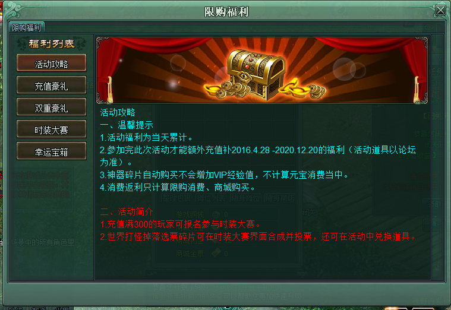
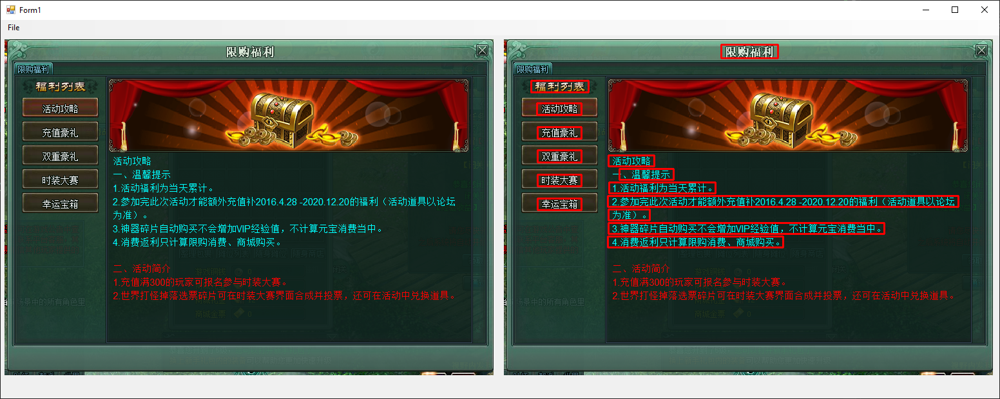

# Image Translation (and Text Detection)

This project is a proof-of-concept project for the on-screen translation for my game launcher: https://github.com/pat266/game-launcher

## Libraries
* `EmguCV` for Text Detection
    * Draw Bounding Rectangle around the text
    * Change values (i.e. `ar`, `brect.Width`, `brect.Height`, etc.) located in `GetBoudingRectangles()` in `Form1.cs` to suit your image
* `IronOCR` for Text Extraction
    * Not using Tesseract since IronOCR gives higher accuracy
* `Google Translate` for Text Translation

## 
## Images

### Text Recognition
#### Original Image

#### After
