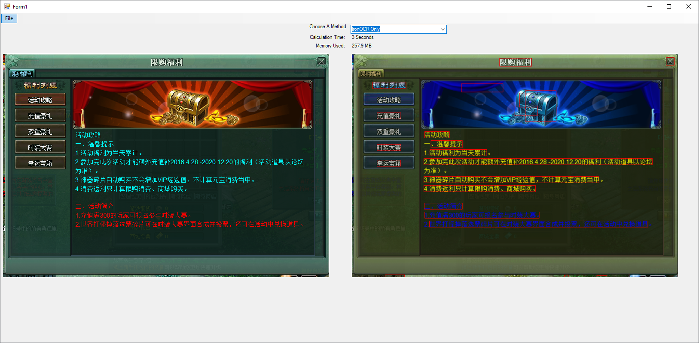
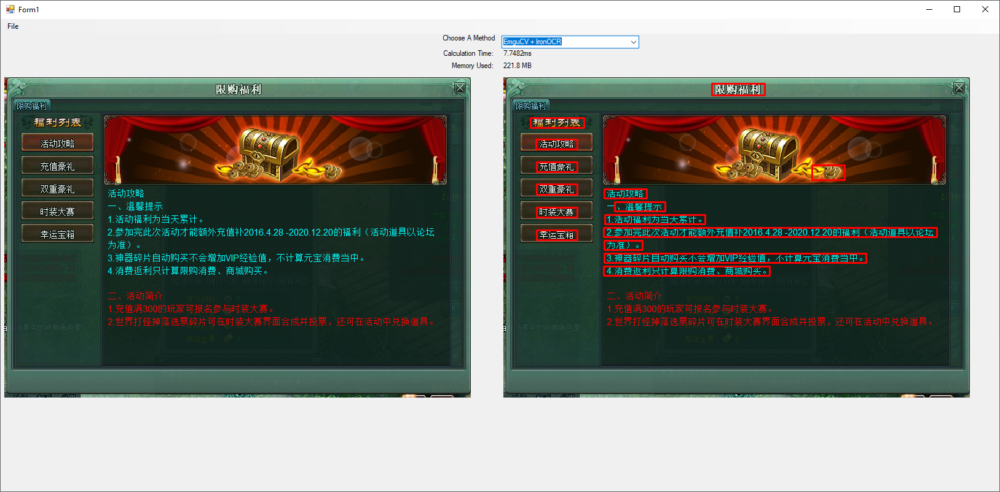
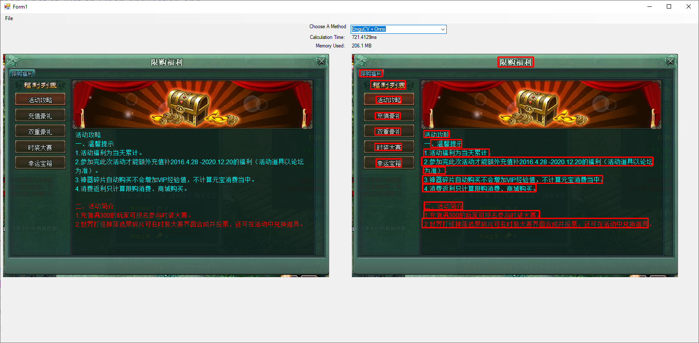
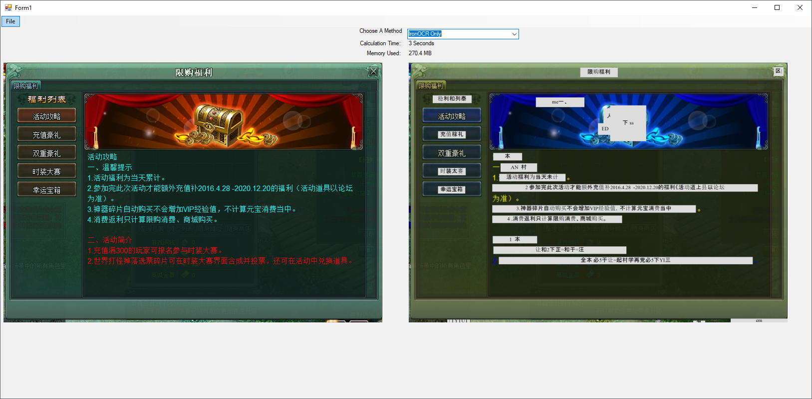
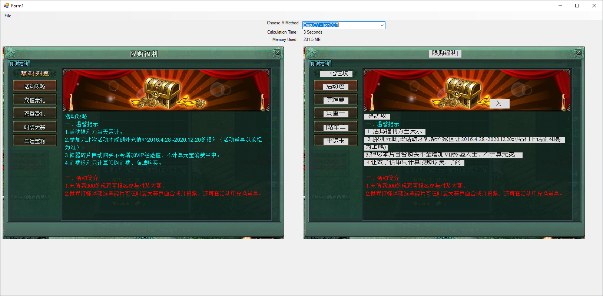
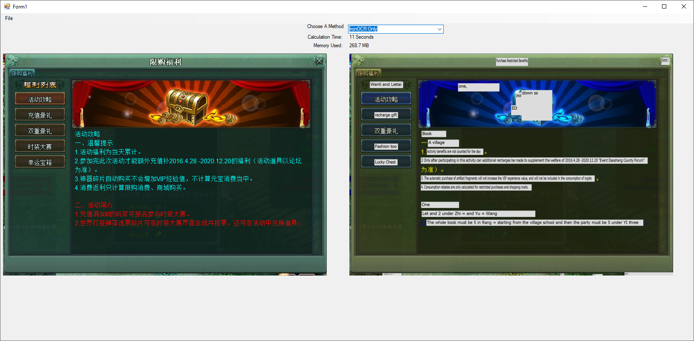
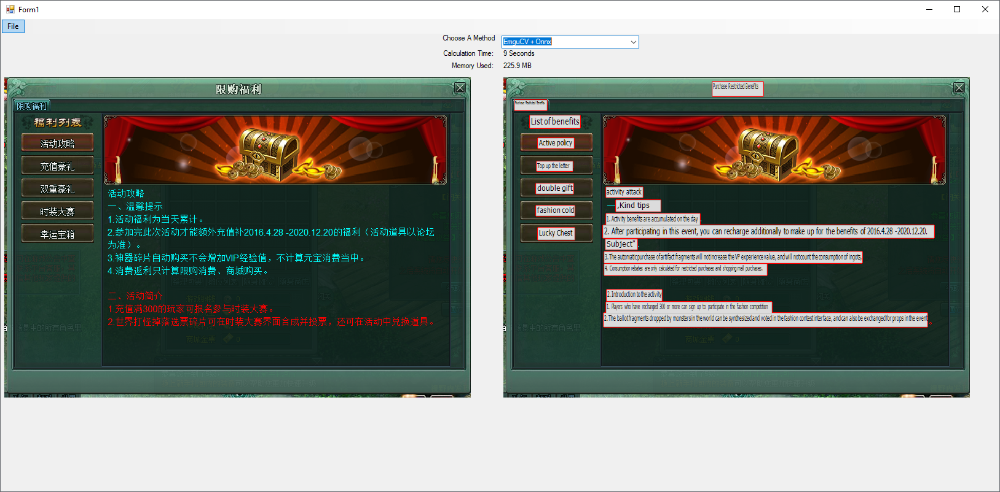

# Image Translation (and Text Detection)

This project is a proof-of-concept project for the on-screen translation for my game launcher: https://github.com/pat266/game-launcher

## Summary
* Using EmguCV for text detection (where the text is at by drawing bounding rectangle around it) and Onnx model for text extraction gives the best result
    * The Onnx model was pre-trained for recognizing Chinese text.
    * It gives much faster result.
    * However, it uses 2x or 3x more memory than IronOCR as the image size increases
* The translator has a delay
    * 5-8 seconds in the images below
    * varied depending on the number of text instances to translate


<br>
Notice:<br>
Copy the models folder to ```\Image_Translator\bin\Debug (or Release)``` (there will be prompt to the exact location if you have not done so)<br>

* [Model](https://github.com/ouyanghuiyu/chineseocr_lite/tree/onnx/models)
* [keys.txt](https://github.com/ouyanghuiyu/chineseocr_lite/tree/onnx/cpp_projects/OcrLiteOnnx/models)
````
Debug\models\
├── angle_net.onnx
├── crnn_lite_lstm.onnx
├── dbnet.onnx
└── keys.txt
````

## Libraries
* `EmguCV` for Text Detection
    * Draw Bounding Rectangle around the text
    * Change values (i.e. `ar`, `brect.Width`, `brect.Height`, etc.) located in `GetBoudingRectangles()` in `Form1.cs` to suit your image
* `IronOCR` for Text Extraction
    * Not using Tesseract since IronOCR gives higher accuracy
* `Onnx` for Text Extraction
    * Performs much better than `IronOCR` at a faster time
* `Google Translate` for Text Translation

## All Major Installed Libraries
* Emgu.CV (4.4.0.4099)
* Emgu.CV.Bitmap (4.4.0.4099)
* Emgu.CV.runtime.windows (4.4.0.4099)
* IronOcr (2022.3.0)
* IronOcr.Languages.Chinese (2020.11.2)
* System.Drawing.Common (4.7.0)
* GTranslate (2.1.0)
    * Installing this from Nuget also installs a lot more lib
* Microsoft.ML.OnnxRuntime (1.12.0)
* Microsoft.ML.OnnxRuntime.Managed (1.12.0)

## Images

### Text Detection
#### IronOCR Only


#### EmguCV + IronOCR


#### EmguCV + Onnx



### Text Extraction
#### IronOCR Only


#### EmguCV + IronOCR


#### EmguCV + Onnx


### Text Translation
#### IronOCR Only


#### EmguCV + IronOCR


#### EmguCV + Onnx

